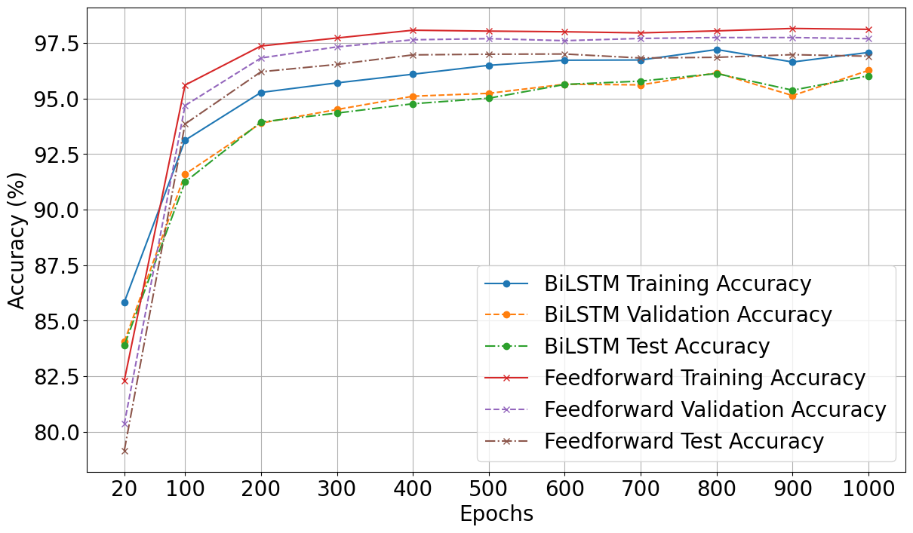

<h1>Emotion Prediction Using Commercial Smartwatches</h1>
 In the 21st century, smart wearable devices such as smartwatches, smart bands, etc., are widespread;
 nearly 224 million people use smartwatches worldwide in 2024, and this number will reach up
 to 228 million by 2026. Such popularity is due to their technological advancements and numerous exciting features, such as health monitoring, activity tracking, fitness tracking, GPS, and
 others. Apart from the basic utility, such devices are enriched with different sensors, such as
 Heat Rate Monitors, Oximetry Sensors, Accelerometers, Gyroscopes, and others. Such sensors
 can capture various physiological and activity-related user data while wearing.
 Such wearable devices can be utilized to predict the emotional state of an individual. Detecting
an emotional state is crucial for understanding the well-being of an individual, as it is associated
 with the quality of their life. One of the early signs of a mental disorder is the bad emotional
 state of a person for a long time. Furthermore, in certain professions, such as aviation
 and transportation, an individual’s emotional condition can directly impact public safety; thus,
 monitoring emotions becomes particularly important. Consequently, there is a growing need
 for emotion recognition systems capable of accurately detecting emotions in real time. In recent
 years, numerous studies have explored the potential of wearable devices and sensor-dense setups
 for predicting emotional states.

  In this work, we analyze and predict emotional states using various physiological data
collected from commercial smartwatches. Here, we have utilized the Lifesnaps public dataset,
 which contains both physiological sensor data and psychological survey data collected from 71
 volunteers from different demographic areas using commercially available Fitbit Sense smartwatches between May 2021 and January 2022. We used 
 study between the physiological data and self-reported emotional states to establish the
 feasibility of the current research. From the correlation, we found that bpm, resting hr, fil
teredDemographicVO2Max and calories show a higher correlation with emotions. We adjusted
 the weight according to the correlation strength. We applied six different non-neural machine
 learning algorithms (SVM, LR, DT, LightGBM, XGBoost, and RF) and achieved the highest
 accuracy of 78.75%. Next, we applied the neural network-based method to predict the emotions
 and get the highest accuracy of 97%. So, our work shows a strong potential for commercially
 available smartwatches to be utilized for emotion detection and mental health monitoring.

